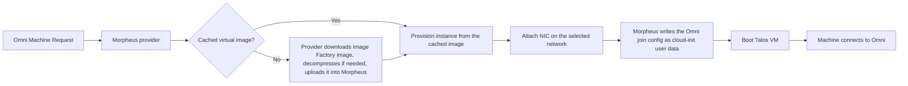

# Omni Infrastructure Provider for Morpheus

A community infrastructure provider that lets [Sidero Omni](https://docs.siderolabs.com/omni/) create, scale, and delete [Talos Linux](https://www.talos.dev/) virtual machines on [HPE Morpheus VM Essentials](https://www.hpe.com/us/en/hpe-morpheus-vm-essentials.html) (MVM).

> [!IMPORTANT]
> This project is community maintained and is not an official Sidero Labs or HPE product. It is an **alpha release**, ported from [omni-infra-provider-vergeos](https://github.com/kreove/omni-infra-provider-vergeos) and [omni-infra-provider-xoa](https://github.com/kreove/omni-infra-provider-xoa).
>
> Unlike those two, this port has **not yet been exercised against a live Morpheus appliance**. The API contract was derived from the official [Morpheus Go SDK](https://github.com/gomorpheus/morpheus-go-sdk), the [Morpheus Terraform provider](https://github.com/gomorpheus/terraform-provider-morpheus) and the published [API reference](https://apidocs.morpheusdata.com/reference/addinstance), and it is covered by unit tests, but expect to need adjustments on first contact. See [Compatibility and limitations](docs/compatibility.md) for what is known-uncertain.

## Features

- Dynamic VM provisioning from Omni Machine Requests
- Clean scale-up, scale-down, and deprovisioning
- Automatic Talos Image Factory downloads, decompressed and imported into Morpheus by the provider
- Image caching by Talos version, architecture, and Omni schematic, reused as a clonable virtual image
- Omni-controlled system extensions and Talos versions
- Optional use of an existing Morpheus virtual image (manual override)
- Every Morpheus object addressable by name or by numeric ID
- NoCloud join config delivery through Morpheus's cloud-init user data
- Docker Compose and Kubernetes deployment examples
- API-token or username/password authentication to Morpheus

## How it works



Omni selects the Talos version and resolves the applicable system extensions into an Image Factory schematic. The provider converts that schematic into an image URL, downloads it, decompresses it when the requested format is compressed, and uploads it into Morpheus as a virtual image with a deterministic, content-derived name. Every later machine needing the same Talos version, architecture and schematic reuses that cached image.

Each machine is then provisioned as a Morpheus instance from that image, with the Omni join config passed through as cloud-init user data.

When Omni no longer needs a machine, the provider powers the instance off and deletes it along with its volumes. Cached virtual images are retained for reuse.

## Requirements

- An Omni instance with administrator access
- A Morpheus appliance managing an MVM (KVM) cloud, reachable from the provider container
- Docker or Kubernetes to run the provider
- A dedicated Morpheus API token (or username/password)
- DNS and HTTPS access from the provider container to the configured Talos Image Factory
- Scratch disk space in the provider container for staging images (a few hundred MB for qcow2, a few GB for raw)
- Network access from provisioned Talos VMs to the Omni endpoints required by your deployment
- `amd64` virtualization hosts

The provider currently supports `amd64` only.

## Quick start

### 1. Register the provider in Omni

The service-account name must match the provider ID. The default provider ID is `morpheus`.

```bash
omnictl infraprovider create morpheus
```

Save the returned `OMNI_ENDPOINT` and `OMNI_SERVICE_ACCOUNT_KEY` values. **The key is shown only at creation and cannot be read back later from the Omni UI** — if you lose it, run `omnictl infraprovider renewkey morpheus` to issue a new one.

### 2. Create a Morpheus account for the provider

Create a dedicated Morpheus user with permission to provision instances and manage virtual images, then either generate an API token for it under **user settings → API access**, or use its username and password.

### 3. Configure and run

```bash
cp deploy/example.env deploy/.env
```

Fill in `OMNI_ENDPOINT`, `OMNI_SERVICE_ACCOUNT_KEY`, `MORPHEUS_ENDPOINT`, and either `MORPHEUS_TOKEN` or `MORPHEUS_USERNAME`/`MORPHEUS_PASSWORD`, then:

```bash
docker compose -f deploy/docker-compose.yml up -d
```

See [Installation](docs/installation.md) for Kubernetes and for building from source.

### 4. Create a Machine Class

In Omni, create a Machine Class backed by this provider and give it provider data describing where to build VMs. Every Morpheus object can be named instead of numbered:

```yaml
cloud:
  name: MVM
group:
  name: Talos
layout:
  name: MVM VM
plan:
  name: Custom
network:
  name: vlan100

cores: 4
memory: 8192
disk_size: 32
architecture: amd64
image_format: qcow2
```

If a name does not resolve, the provider fails the Machine Request with an error listing every object it *could* have matched, with IDs — so a wrong name is a copy-and-paste fix rather than an API hunt.

See [Configuration](docs/configuration.md) for the full schema, and [`examples/`](examples/) for complete files.

## Documentation

- [Installation](docs/installation.md)
- [Configuration](docs/configuration.md)
- [Usage](docs/usage.md)
- [Images and system extensions](docs/images-and-extensions.md)
- [Architecture](docs/architecture.md)
- [Compatibility and limitations](docs/compatibility.md)
- [Troubleshooting](docs/troubleshooting.md)
- [Development](docs/development.md)

## License

[MPL-2.0](LICENSE).
